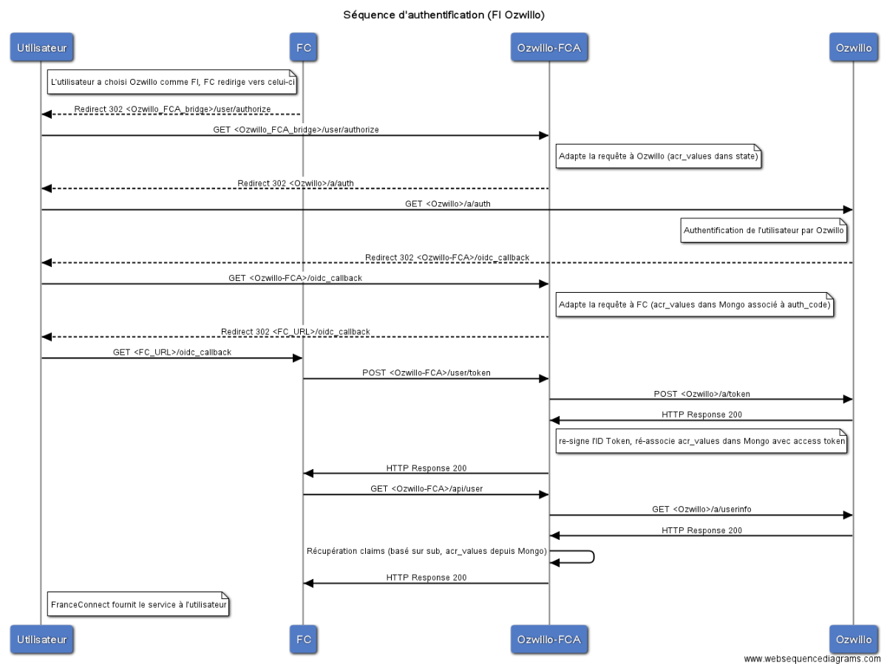

Connecteur Ozwillo ↔ FranceConnect Agent (Proof of Concept)
===========================================================

Ce projet est une preuve de concept pour connecter Ozwillo à [FranceConnect Agent][FCA] en tant que [Fournisseur d'Identité][FCA-FI], développé par [Atol Conseils & Développements](https://www.atolcd.com/) sur une commande du [SICTIAM](http://www.sictiam.fr/).

FranceConnect Agent et Ozwillo utilisent tous deux OpenID Connect 1.0 pour authentifier les utilisateurs, mais ne sont pas directement compatibles.  
FCA ajoute également une nouvelle notion d'attributs.

Différences techniques entre Ozwillo et FCA
-------------------------------------------
La première différence n'est pas technique : les identités FCA doivent être vérifiées, alors qu'elles peuvent actuellement être librement modifiées par l'utilisateur dans le cas d'Ozwillo. FCA impose également la présence de certaines informations spécifiques.  
Cette différence ne sera pas résolue dans le cadre du PoC.

Les autres différences sont :
 * FCA envoie ses credentials (`client_id` / `client_secret`) dans le corps de la requête au Token Endpoint, plutôt qu'en utilisant le framework d'authentification au niveau HTTP (HTTP Basic).
 * L'ID Token (et plus généralement les JSON Web Tokens) doivent être signés avec l'algorithme HMAC SHA256 (HS256) pour FCA, la clé du HMAC étant le `client_secret` de FCA. Ozwillo utilise RS256, et expose sa clé publique au format JSON Web Key Set.
 * FCA détourne le paramètre `acr_values` pour demander des attributs spécifiques (au lieu d'utiliser, par exemple, le paramètre `claims`).
 * Ozwillo devra (probablement) renvoyer le claim `acr` indépendamment des `acr_values` demandées (il n'est pas documenté si FCA indique un niveau de garantie dans `acr_values` aux fournisseurs d'identité, en plus des noms des attributs, mais les exemples laissent penser que ce n'est pas le cas).
 * FCA utilise des valeurs spécifiques pour `acr` qui ne sont pas valides du point de vue d'OpenID Connect (ne sont pas des URIs et ne sont pas enregistrées).
 * FCA défini des claims additionnels et requis dans l'identité de l'utilisateur : birthplace et birthcountry.
 * FCA défini des scopes spécifiques correspondant notamment à ces claims additionnels, ou segmentant le scope standard profile en plus petites parties.

Pour masquer ces différences, il a été décidé de créer un « bridge » entre FCA et Ozwillo plutôt que faire des modifications substantielles à Ozwillo, les données absentes d'Ozwillo (`birthplace`, `birthcountry` et attributs) étant alors stockés dans une base de données MongoDB spécifique (et pré-remplies manuellement pour des comptes de test prédéfinis, dans le cadre du PoC).  
Ce « bridge » devrait également permettre un développement plus rapide (notamment par l'externalisation des données spécifiques à FCA). Il joue ainsi, tout comme FCA, les rôles à la fois d'OpenID Provider / Fournisseur d'Identité (vis-à-vis de FCA) et de Relying Party (du point de vue d'Ozwillo).  
Les `client_id` et `client_secret` peuvent être partagés entre le _bridge_ et FCA : déclarés dans le Kernel Ozwillo où le `client_secret` est haché, stockés dans le _bridge_ (en clair, dans le cadre du PoC) et transmis à FCA.

Le _bridge_ aura ainsi besoin de stocker à la fois les informations spécifiques concernant les utilisateurs, ainsi que des informations temporaires relatives au processus d'authentification. Pour ces dernières, une collection MongoDB sera créée avec un index permettant de faire expirer les données (c'est ainsi MongoDB qui gère l'expiration et non le code applicatif, qui se contente d'indiquer la date d'expiration pour chaque donnée).

Le _bridge_ est développé en Go, notamment pour sa simplicité de mise en œuvre et de déploiement.

Détail du fonctionnement
------------------------

Détail des flux
---------------

Lorsque le _bridge_ reçoit la requête sur l'Authentication Endpoint, il encode tous les arguments spécifiques à FCA dans un nouveau `state` avant de rediriger vers le Kernel Ozwillo, remplaçant également la `redirect_uri` par l'URL de son propre Redirection Endpoint. Tous les autres paramètres de la requête (à l'exception donc des paramètres spécifiques à FCA, du `state`, et de la `redirect_uri`) sont transmis tels quels.

Au retour sur le Redirection Endpoint, le `state` est décodé pour retrouver le `state` initial de FCA. En cas d'erreur, celle-ci est relayée directement à FCA. Sinon, le `state` décodé est stocké dans MongoDB en utilisant le `code` comme identifiant, et expirant après une minute (c'est la durée de validité du code par défaut côté Ozwillo).

Lorsque le _bridge_ reçoit la requête sur le Token Endpoint, il authentifie FCA avec le client_id et client_secret, récupère les informations stockées dans MongoDB correspondant au `code` (et les supprime immédiatement) puis transmet la requête au Kernel Ozwillo.  
La réponse du Token Endpoint d'Ozwillo est décodée avant d'être renvoyée à FCA : l'ID Token est re-signé en HS256 avec le `client_secret` (après substitution de l'`iss` pour référencer le _bridge_), et le `state` décodé est ré-inséré dans MongoDB, cette fois-ci en utilisant l'`access_token` comme identifiant, et utilisant l'expiration de l'`access_token` indiquée dans la réponse.

Lorsque le _bridge_ reçoit la requête sur le UserInfo Endpoint, il récupère les informations stockées dans MongoDB correspondant au token transmis dans la requête, et transmet la requête à Ozwillo.  
La réponse du Token Endpoint d'Ozwillo est alors augmentée des informations relatives à l'utilisateur : ces informations sont récupérées dans MongoDB sur la base du `sub` retourné par Ozwillo et filtrées selon les `acr_values` reçues sur la requête initiale à l'Authentication Endpoint (et conservées jusqu'ici grâce au `state` et aux stockages successifs dans MongoDB) ; le `birthplace` et `birthcountry` sont ajoutées directement à l'objet JSON, et les autres attributs codés comme Aggregated Claims tel qu'attendu par FCA, dans un JWT signé en HS256 avec le `client_secret`.

Déploiement
-----------

Le _bridge_ est destiné à être déployé derrière un reverse-proxy prenant en charge la terminaison TLS. Il utilise les entêtes `X-Forwarded-Proto` et `Host` (**pas** `X-Forwarded-Host`) pour calculer les URLs, ces entêtes doivent donc être correctement positionnées par le reverse-proxy.

[FCA]: https://fcagentdevelopers.integ01.dev-franceconnect.fr/
[FCA-FI]: https://fcagentdevelopers.integ01.dev-franceconnect.fr/fournisseur-identite
